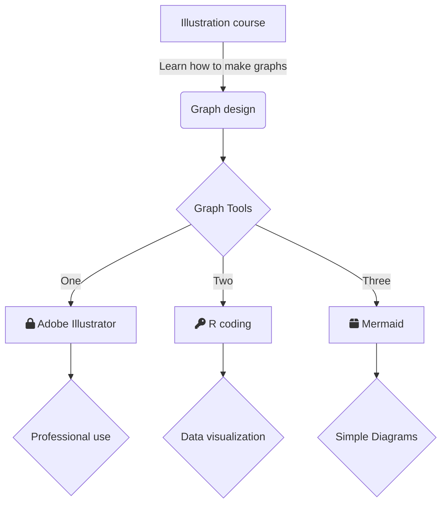

# Mermaid

```mermaid
flowchart TD
    A[Illustration course] -->|Learn how to make graphs| B(Graph design)
    B --> C{Graph Tools}
    C -->|One| D[fa:fa-lock Adobe Illustrator]
    C -->|Two| E[fa:fa-key R coding]
    C -->|Three| F[fa:fa-box Mermaid]
    D --> G{Professional use}
    E --> H{Data visualization}
    F --> I{Simple Diagrams}
```
